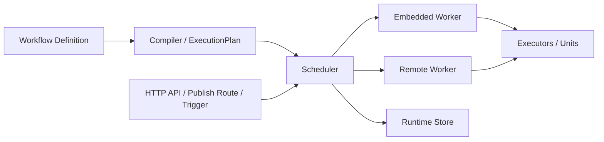

# go-workflow

`go-workflow` 是一个面向编排与调度的 Go 工作流引擎，当前按三段式架构组织：

1. `core`
   共享定义、执行计划、运行时、执行器抽象、worker 协议。
2. `scheduler`
   控制面，负责 workflow/version 管理、编译、调度、状态机、运行时存储、发布入口。
3. `worker`
   数据面，负责真正执行节点任务；可以内嵌到调度器，也可以独立部署。

项目当前已经支持：

- 嵌入式单进程运行
- 独立 worker 注册/心跳/远程执行
- `unit` / `local_go` / `http` / `script` / `queue` / remote worker executor
- workflow/version 管理 API
- run 查询、事件、快照
- publish route / HTTP trigger
- persistent time automations with structured schedules
- strict OpenAPI-generated reusable service operations
- pause / resume / cancel
- 分支条件、Parallel Gateway、节点级 loop、显式 back-edge
- 内存 store 和 Gorm store

作为 Go 核心库嵌入时的包边界、注册所有权和兼容策略见
[`docs/library-contract.md`](docs/library-contract.md)。完整的依赖引入、自定义 Unit、
工作流创建运行和持久化示例见 [`docs/embedding-guide.md`](docs/embedding-guide.md)。

Web 编辑器可以把 OpenAPI 3.0/3.1 JSON/YAML 中受支持的操作批量安装为可复用服务。普通用户
只看到自动生成的选择项和运行表单；multipart 文件在每次运行时选择，不会保存到服务配置。
源文档仅用于开发者导入与审查。支持边界、凭据规则和运行时安全校验见
[`docs/openapi-operation-unit.md`](docs/openapi-operation-unit.md)。

## 架构



## 安装

```bash
go get github.com/ninenhan/go-workflow
```

默认 ORM 使用单实例 SQLite，并自动装配定义、运行、工作区、自动化和加密凭据存储：

```go
app, err := workflow.OpenDefault(ctx)
if err != nil {
    return err
}
defer app.Close()
```

无数据库模式使用完整内存实现：

```go
app, err := workflow.OpenMemory(ctx)
```

MySQL、自定义 Store 和自定义 worker 使用严格入口 `workflow.New`；缺失任何 Store 都会
直接报错，不会隐式退回内存。完整配置见
[`docs/embedding-guide.md`](docs/embedding-guide.md)。

## V0 PC Web

V0 可以把生产构建后的 Web、工作流 API、内嵌 worker、SQLite 状态和加密凭据存储运行在
同一个进程中。前后端仓库位于相邻目录时，从本仓库执行：

```bash
./scripts/run-v0.sh
```

然后打开 `http://127.0.0.1:55080/`。脚本严格使用前端锁文件安装依赖并重新构建，不会使用
旧的 `dist` 或退回 Vite 开发代理。非相邻目录、运行数据、监听地址以及完整发布检查见
[`docs/v0-desktop.md`](docs/v0-desktop.md)。

生成无需开发工具链的当前平台发布包：

```bash
./scripts/build-v0-release.sh
```

一次生成 macOS Apple Silicon、Windows x64 和 Linux x64 桌面包：

```bash
./scripts/build-v0-desktop-releases.sh
```

V0 通过同一个 `runtimehost` 支持 Docker Server、Electron Desktop 和无界面
Headless CLI。三种宿主的严格模式、构建与运行命令见
[`docs/v0-hosts.md`](docs/v0-hosts.md)。

`workflow-server` 的实现和可执行入口均位于本仓库。Go 应用也可以通过
`runtimehost.New`、`Host.Start` 和 `Host.Shutdown` 显式启用同进程单节点；
未启用时不会监听端口或创建运行数据。独立的 `go-workflow-server` 仓库不再承载
运行时实现。

## 最小可运行示例

下面这个示例以嵌入式 worker 方式运行，不需要额外进程：

```go
package main

import (
	"context"
	"fmt"

	"github.com/ninenhan/go-workflow/core/definition"
	"github.com/ninenhan/go-workflow/scheduler"
	"github.com/ninenhan/go-workflow/worker"
	workerunit "github.com/ninenhan/go-workflow/worker/unit"
)

type GreetingUnit struct {
	workerunit.Unit
}

func (u *GreetingUnit) GetUnitName() string { return "GreetingUnit" }
func (u *GreetingUnit) GetUnitMeta() *workerunit.Unit { return &u.Unit }

func (u *GreetingUnit) Execute(ctx context.Context, state workerunit.ContextMap, self *workerunit.Node) (*workerunit.ExecutionResult, error) {
	name := "world"
	if prev := state["prepare"]; prev != nil {
		if text, ok := prev.Data.(string); ok && text != "" {
			name = text
		}
	}
	return &workerunit.ExecutionResult{
		NodeName: u.GetUnitName(),
		Data: map[string]any{
			"message": "hello, " + name,
		},
	}, nil
}

func main() {
	workerSvc, err := worker.NewService(worker.Options{
		Enabled:          true,
		RegisterBuiltins: true,
	})
	if err != nil {
		panic(err)
	}

	if err := workerSvc.UnitRegistry().RegisterUnitFactory("GreetingUnit", func() workerunit.ExecutableUnit {
		unit := &GreetingUnit{}
		unit.UnitName = unit.GetUnitName()
		return unit
	}); err != nil {
		panic(err)
	}

	svc, err := scheduler.NewService(scheduler.Options{
		EnableEmbeddedWorker: true,
		EmbeddedWorker:       workerSvc,
	})
	if err != nil {
		panic(err)
	}

	run, err := svc.RunDefinition(context.Background(), &definition.WorkflowDefinition{
		ID:         "wf-quickstart",
		Name:       "quickstart",
		EntryNodes: []string{"prepare"},
		Nodes: []definition.Node{
			{
				ID:       "prepare",
				Name:     "prepare",
				Executor: definition.ExecutorSpec{Type: definition.ExecutorTypeUnit, Ref: "RemarkUnit"},
				Input:    "go-workflow",
			},
			{
				ID:       "greet",
				Name:     "greet",
				Executor: definition.ExecutorSpec{Type: definition.ExecutorTypeUnit, Ref: "GreetingUnit"},
			},
		},
		Edges: []definition.Edge{
			{From: "prepare", To: "greet"},
		},
	}, nil)
	if err != nil {
		panic(err)
	}

	fmt.Println("run status:", run.Status)
	fmt.Printf("greet result: %#v\n", run.Context.NodeResults["greet"])
}
```

输出会类似：

```text
run status: success
greet result: map[string]interface {}{"message":"hello, go-workflow"}
```

## 运行模式

### 1. 嵌入式模式

适合本地开发、单机部署、功能验证。

```go
svc, err := scheduler.NewService(scheduler.Options{
	EnableEmbeddedWorker: true,
})
```

### 2. 纯调度器模式

调度器只负责编排与状态机，执行全部下发到独立 worker。

```go
svc, err := scheduler.NewService(scheduler.Options{
	EnableEmbeddedWorker: false,
})
```

独立 worker 暴露自己的执行接口，并向 scheduler 注册：

```go
import (
	"context"
	"net/http"

	"github.com/ninenhan/go-workflow/core"
	"github.com/ninenhan/go-workflow/worker"
)

workerSvc, err := worker.NewService(worker.Options{
	Enabled:          true,
	RegisterBuiltins: true,
})
if err != nil {
	panic(err)
}

go http.ListenAndServe(":9090", workerSvc.Handler())

descriptor := workerSvc.Descriptor(core.WorkerDescriptor{
	ID:            "worker-1",
	Name:          "default-worker",
	Endpoint:      "http://127.0.0.1:9090",
	Tenant:        "default",
	Labels:        map[string]string{"pool": "default"},
	Weight:        1,
	MaxConcurrent: 32,
})

go func() {
	if err := workerSvc.MaintainRegistration(context.Background(), worker.RegistrationOptions{
		SchedulerEndpoint: "http://127.0.0.1:8080",
		Descriptor:        descriptor,
	}); err != nil {
		panic(err)
	}
}()
```

## HTTP API

运行凭据使用独立的作用域存储，只在 worker 的执行上下文中解析。内置服务默认以
AES-256-GCM 加密并原子写入 `.go-workflow-data`，进程重启后仍可使用；密钥、密文或权限
异常时会拒绝启动而不会退回明文或内存存储。凭据值不会进入工作流定义、任务协议、运行结果
或列表响应。管理 API、作用域约束和远程 resolver 扩展方式见
[`docs/credentials.md`](docs/credentials.md)。

scheduler 自带 HTTP 控制面：

本地开发可以直接启动带嵌入式 worker 和内置 Units 的服务；默认地址与 Web 编辑器代理一致：

```bash
go run ./cmd/workflow-server
```

发布工作流、版本、运行状态、快照和事件默认持久化到
`.go-workflow-data/workflow.db`。通过 `WORKFLOW_ADDR` 可以覆盖监听地址，通过
`WORKFLOW_DATA_DIR` 可以移动整个运行数据目录。

- `POST /v1/workflows`
- `GET /v1/workflows`
- `GET /v1/automations`
- `POST /v1/workflows/{workflow_id}/versions`
- `GET /v1/workflows/{workflow_id}/contract`
- `POST /v1/workflows/{workflow_id}/invoke`
- `POST /v1/workflows/{workflow_id}/invoke?wait=false`
- `POST /v1/workflow-versions/{version_id}/publish`
- `POST /v1/workflow-versions/{version_id}/runs`
- `GET /v1/runs`
- `GET /v1/runs/{id}`
- `GET /v1/runs/{id}/events`
- `GET /v1/runs/{id}/stream`
- `GET /v1/runs/{id}/snapshots`
- `POST /v1/runs/{id}/pause`
- `POST /v1/runs/{id}/resume`
- `POST /v1/runs/{id}/cancel`
- `GET /v1/workers`

Time automations support daily, weekdays, selected weekdays, and fixed interval
schedules. They become active only after publication and persist across process
restarts. Configuration and recovery semantics are documented in
[`docs/automations.md`](docs/automations.md).
- `POST /v1/workers/register`
- `POST /v1/workers/heartbeat`

还支持：

- `PublishConfig.Route` 发布为业务 API
- `TriggerHTTP` 直接触发工作流

## 一个简单的 workflow version 发布流程

创建 workflow：

```bash
curl -X POST http://127.0.0.1:8080/v1/workflows \
  -H 'Content-Type: application/json' \
  -d '{
    "id": "wf-doc-demo",
    "name": "doc demo"
  }'
```

创建 version：

```bash
curl -X POST http://127.0.0.1:8080/v1/workflows/wf-doc-demo/versions \
  -H 'Content-Type: application/json' \
  -d '{
    "version": {
      "id": "wf-doc-demo:v1",
      "workflow_id": "wf-doc-demo",
      "version": 1,
      "status": "draft",
      "definition": {
        "id": "wf-doc-demo",
        "name": "doc demo",
        "entry_nodes": ["n1"],
        "publish_config": {
          "enabled": true,
          "route": "/api/doc-demo",
          "method": "POST",
          "input_mode": "body",
          "response_mode": "run",
          "timeout": 10000
        },
        "nodes": [
          {
            "id": "n1",
            "name": "echo",
            "executor": {
              "type": "unit",
              "ref": "LogUnit"
            },
            "input": "hello from published workflow"
          }
        ]
      }
    }
  }'
```

发布 version：

```bash
curl -X POST http://127.0.0.1:8080/v1/workflow-versions/wf-doc-demo:v1/publish
```

调用发布路由：

```bash
curl -X POST http://127.0.0.1:8080/api/doc-demo \
  -H 'Content-Type: application/json' \
  -d '{"hello":"world"}'
```

## LLMUnit 示例

内置 `LLMUnit` 走 `unit` executor，要求环境变量里有 `OPENAI_API_KEY`：

```json
{
  "id": "llm",
  "name": "ask-model",
  "executor": {
    "type": "unit",
    "ref": "LLMUnit"
  },
  "input": "用一句话介绍 go-workflow",
  "params": {
    "model": "gpt-4o-mini",
    "system": "你是一个简洁的技术助手",
    "stream": false,
    "timeout_ms": 30000
  }
}
```

## 节点输入绑定

当前支持显式声明“这个节点的输入来自哪些直接前驱节点的 output”。

规则：

1. `edge` / `depends_on` 决定节点什么时候可以执行。
2. `input_spec` 决定真正传给 executor 的 `task.Input` 怎么组装。
3. `source=node` 时，`input_spec.bindings[].from` 必须是当前节点的直接前驱，否则编译失败。
4. 不配置 `input_spec` 时，行为保持旧语义，仍然直接使用节点自己的 `input`。
5. `default` 可以为缺失输入提供兜底值。
6. `transform` 可以对绑定结果做轻量表达式变换。
7. 现在还支持多来源绑定：`node / var / request / run`。

示例：

```json
{
  "id": "summary",
  "name": "summary",
  "executor": {
    "type": "unit",
    "ref": "LogUnit"
  },
  "input": {
    "kind": "summary"
  },
  "input_spec": {
    "mode": "object",
    "bindings": [
      { "from": "user", "path": "name", "as": "user", "required": true },
      { "from": "score", "path": "value", "as": "score", "required": true }
    ]
  }
}
```

这会把最终输入组装成：

```json
{
  "kind": "summary",
  "user": "...",
  "score": 98
}
```

其中：

1. `source=node` 时，`from` 表示前驱节点 ID
2. `source=var` 时，`from` 表示工作流运行变量名
3. `source=request` 时，默认从 `run.Context.Variables["request"]` 取值
4. `source=run` 时，可读取 `run_id/workflow_id/workflow_version_id/variables/node_results` 等运行态字段

也支持：

```json
{
  "input_spec": {
    "mode": "object",
    "bindings": [
      { "from": "user", "path": "name", "as": "name", "required": true, "transform": "Value + \"-vip\"" },
      { "from": "user", "path": "title", "as": "title", "default": "guest" }
    ]
  }
}
```

## 参数文本模板

`param_templates` 用于把固定文本与多个运行时绑定组合成一个字符串参数。它是结构化模型，不需要在普通参数中嵌入表达式：

```json
{
  "params": {
    "method": "GET"
  },
  "param_templates": {
    "url": {
      "segments": [
        { "type": "text", "value": "https://api.example.com/search?q=" },
        {
          "type": "binding",
          "binding": {
            "source": "node",
            "from": "summary",
            "path": "text",
            "required": true
          }
        },
        { "type": "text", "value": "&owner=" },
        {
          "type": "binding",
          "binding": {
            "source": "var",
            "from": "owner",
            "required": true
          }
        }
      ]
    }
  }
}
```

规则：

1. 同一个参数键不能同时出现在 `param_bindings` 和 `param_templates`。
2. `binding` 片段使用与 `input_spec` 相同的来源、路径、必填、默认值和变换规则。
3. `source=node` 仍必须引用当前节点的直接依赖，编译器会拒绝隐式跨图读取。
4. 字符串保持原值，数字和布尔值使用稳定文本表示，对象与数组编码为 JSON。
5. 模板片段按声明顺序解析；任一必填绑定缺失时，节点不会执行。

## 文档

- [Parallel Gateway](/Users/freddon/Lab/go_modules/github.com/go-workflow/docs/parallel-gateway.md)
- [Concurrency Groups and Resource Pools](/Users/freddon/Lab/go_modules/github.com/go-workflow/docs/concurrency-resources.md)
- [Quickstart](/Users/freddon/Lab/go_modules/github.com/go-workflow/docs/quickstart.md)
- [Three Part Architecture](/Users/freddon/Lab/go_modules/github.com/go-workflow/docs/three-part-architecture.md)
- [Control Plane API](/Users/freddon/Lab/go_modules/github.com/go-workflow/docs/control-plane-api.md)
- [Worker Runtime](/Users/freddon/Lab/go_modules/github.com/go-workflow/docs/worker-runtime.md)
- [Worker Protocol v1](/Users/freddon/Lab/go_modules/github.com/go-workflow/docs/worker-protocol-v1.md)
- [Runtime Control](/Users/freddon/Lab/go_modules/github.com/go-workflow/docs/runtime-control.md)
- [Runtime Store](/Users/freddon/Lab/go_modules/github.com/go-workflow/docs/runtime-store.md)

## 当前边界

当前已经具备生产级骨架，但有几个边界要明确：

1. `scheduler` 是控制面，不建议承载复杂执行实现。
2. 标准单元注册建议放到 worker。
3. `queue` 当前已经可用，但内置 broker 主要用于单机/验证场景。
4. graph loop 是受控循环，不是任意无约束环图。
